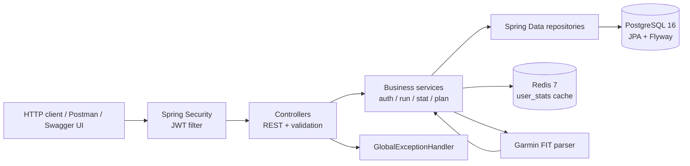

# Runtrack

Runtrack is a Spring Boot API for tracking running activities. It provides JWT
authentication, manual and FIT activity imports, personal records, Redis-backed
statistics, and training plans.

## Features

- User registration and authentication with BCrypt and 24-hour JWTs.
- Create, view, update, and delete running activities.
- Import `.fit` activities, including lap extraction and split creation.
- Automatic detection and recalculation of personal records for 1 km, 5 km,
  10 km, and half-marathon distances.
- Overall and weekly statistics with Redis caching.
- Training plans, planned sessions, and links between planned and completed runs.
- Centralized business validation and consistent HTTP error responses.
- Unit tests and a Spring context test using PostgreSQL and Redis Testcontainers.

## Architecture



Controllers are dedicated to HTTP concerns. Services contain the business
rules, repositories handle data access, and `GlobalExceptionHandler` translates
exceptions into API responses.

## Getting started

Requirements: Java 21, Docker, and Docker Compose.

```bash
docker compose up -d && ./mvnw spring-boot:run
```

The application is then available at `http://localhost:8080`. PostgreSQL
listens on port `5432` and Redis on port `6379`. Flyway migrations run
automatically at startup.

## API documentation

- Swagger UI: http://localhost:8080/swagger-ui.html
- OpenAPI JSON: http://localhost:8080/v3/api-docs
- Postman collection:
  [`docs/postman/runtrack.postman_collection.json`](docs/postman/runtrack.postman_collection.json)

To test protected endpoints:

1. Call `POST /api/v1/auth/register` or `POST /api/v1/auth/login`.
2. Copy the returned JWT.
3. Click **Authorize** in Swagger UI and paste the token without adding a
   second `Bearer` prefix.

## Main endpoints

| Domain | Endpoints |
| --- | --- |
| Authentication | `POST /api/v1/auth/register`, `POST /api/v1/auth/login` |
| Runs | `POST /api/v1/runs`, `GET /api/v1/runs`, `GET /api/v1/runs/{id}`, `PUT /api/v1/runs/{id}`, `DELETE /api/v1/runs/{id}` |
| FIT import | `POST /api/v1/runs/import/fit` with `multipart/form-data` |
| Statistics | `GET /api/v1/stats/overall`, `GET /api/v1/stats/weekly` |
| Training plans | `POST /api/v1/plans`, `GET /api/v1/plans/active`, `PATCH /api/v1/plans/{id}/status` |

## Swagger UI screenshots

Screenshots should be taken with the application running so they show the
documentation generated by the current API version. The expected locations are:

- `docs/screenshots/swagger-overview.png`
- `docs/screenshots/swagger-authorize.png`

Open http://localhost:8080/swagger-ui.html to take the screenshots. The second
capture should show the **Authorize** dialog after JWT authentication has been
configured.

## Tests

Unit tests do not require external infrastructure. The Spring context test uses
Testcontainers and requires a running Docker engine.

```bash
./mvnw test
```

## Technology stack

Java 21 · Spring Boot · Spring MVC · Spring Security · Spring Data JPA ·
PostgreSQL · Flyway · Redis · Testcontainers · JUnit 5 · Mockito · OpenAPI
